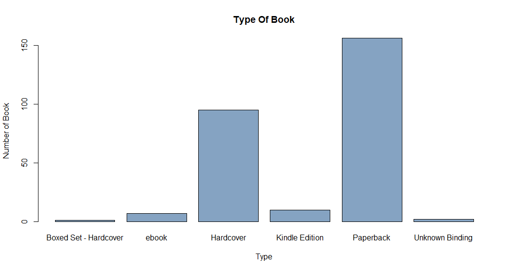
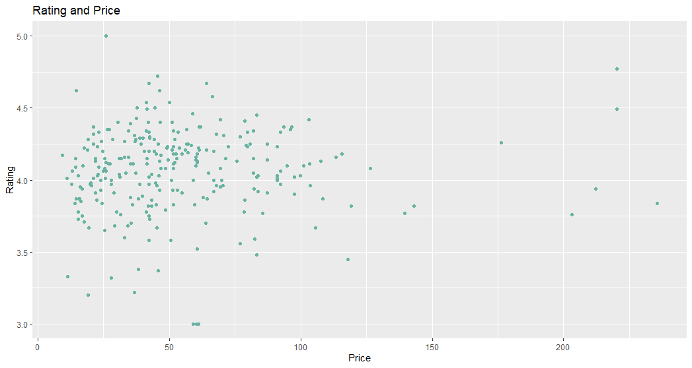

# R-Assignment 4

**Created by Thiraphat Itamonchai(ID: 63130500060)**

Choose Dataset:
1. Top 270 Computer Science / Programing Books (Data from Thomas Konstantin, [Kaggle](https://www.kaggle.com/thomaskonstantin/top-270-rated-computer-science-programing-books)) >> [Using CSV](https://raw.githubusercontent.com/safesit23/INT214-Statistics/main/datasets/prog_book.csv)


### Outlines
1. Explore the dataset
2. Learning function from Tidyverse
3. Transform data with dplyr and finding insight the data
4. Visualization with GGplot2

## Part 1: Explore the dataset

```
# Dataset
programming_book <- read.csv('https://raw.githubusercontent.com/safesit23/INT214-Statistics/main/datasets/prog_book.csv')

```

In this dataset has
```
#library
library(dplyr)
library(readr)
#show data type each columns
glimpse(programming_book)
```
```
Rows: 271
Columns: 7
$ Rating          <dbl> 4.17, 4.01, 3.33, 3.97, 4.06, 3.84, 4.09, 4.15, 3.87, 4.62, 4.03, 3.78, 3.…
$ Reviews         <chr> "3,829", "1,406", "0", "1,658", "1,325", "117", "5,938", "1,817", "2,093",…
$ Book_title      <chr> "The Elements of Style", "The Information: A History, a Theory, a Flood", …
$ Description     <chr> "This style manual offers practical advice on improving writing skills. Th…
$ Number_Of_Pages <int> 105, 527, 50, 393, 305, 288, 256, 368, 259, 128, 352, 352, 200, 328, 240, …
$ Type            <chr> "Hardcover", "Hardcover", "Kindle Edition", "Hardcover", "Kindle Edition",…
$ Price           <dbl> 9.323529, 11.000000, 11.267647, 12.873529, 13.164706, 14.188235, 14.232353…
```
- Rating : คะแนนหนังสือ
- Reviews : จำนวนความคิดเห็น
- Book_title : ชื่อหนังสือ
- Description : คำอธิบาย
- Number_Of_Pages : จำนวนของหนังสือ
- Type : รูปแบบหนังสือ
- Price : ราคาหนังสือ

1. สรุปข้อมูลเบื้องต้น
```
programming_book %>% select(-Type , -Book_title , -Description , -Reviews) %>% summary()
```
Result :
```
  Rating      Number_Of_Pages      Price        
 Min.   :3.000   Min.   :  50.0   Min.   :  9.324  
 1st Qu.:3.915   1st Qu.: 289.0   1st Qu.: 30.751  
 Median :4.100   Median : 384.0   Median : 46.318  
 Mean   :4.067   Mean   : 475.1   Mean   : 54.542  
 3rd Qu.:4.250   3rd Qu.: 572.5   3rd Qu.: 67.854  
 Max.   :5.000   Max.   :3168.0   Max.   :235.650 
```
## Part 2: Learning function from Tidyverse

- Function `str_remove()` from package stringr It using for select columns

```
#Loading library
library(stringr)
#remove string
progrimming_book$Reviews <- progrimming_book$Reviews %>% str_remove(",") %>% str_trim() %>% as.numeric()
#Change data type
progrimming_book$Type <- progrimming_book$Type %>% as.factor()         
```
** ทำให้สามารถลบตัวหนังสือที่ไม่ต้องการออกได้

## Part 3: Transform data with dplyr and finding insight the data

1. How many the book title have a number of Reviews more than average
หนังสือเล่มไหนที่มี Reviews เยอะกว่าค่าเฉลี่ยของ Reviews
```
mean_review <- progrimming_book$Reviews %>% mean(.)
reviewer <- progrimming_book %>% select(Book_title,Reviews) %>% filter(Reviews > mean_review)

```
Result:
```
Rows: 46
Columns: 2
$ Book_title <chr> "The Elements of Style", "The Information: A History, a Theory, a Flood", "~
$ Reviews    <dbl> 3829, 1406, 1658, 1325, 5938, 1817, 2093, 481, 1255, 593, 417, 279, 370, 20~
```
ค่าเฉลี่ยของ Reviews จะอยู่ที่ 185 Review ดังนั้นจะมีหนังสืออยู่ 46 เล่ม ที่มี Review เยอะกว่าค่าเฉลี่ย

2. How many the book title book have Type is ebook
มีหนังสือเล่มกี่เล่มที่มี Type เป็น ebook
```
ebook <- progrimming_book %>% select(Book_title,Type) %>% filter(Type == "ebook") 

```
Result:
```
Rows: 7
Columns: 2
$ Book_title <chr> "Your First App: Node.js", "Algorithms Unlocked", "Learn You a Haskell for ~
$ Type       <fct> ebook, ebook, ebook, ebook, ebook, ebook, ebook
```
จะมีหนังสืออยู่ 7 เล่มที่มี Type เป็น ebook

3. How many book cheap and good rating(compare with average)
มีหนังสื่อกี่เล่มที่ราคาถูกและมีคะแนนที่ดี (เปรียบเทียบกับค่าเฉี่ลยของแต่อย่าง)
```
mean_price <- progrimming_book$Price %>% mean(.)
mean_rate <- progrimming_book$Rating %>% mean(.) 
book <- progrimming_book %>% select(Book_title,Rating,Price) %>% filter(Price < mean_price & Rating > mean_rate)
```
Result:
```
Rows: 89
Columns: 3
$ Book_title <chr> "The Elements of Style", "Start with Why: How Great Leaders Inspire Everyon~
$ Rating     <dbl> 4.17, 4.09, 4.15, 4.62, 4.10, 4.22, 4.21, 4.28, 4.37, 4.25, 4.32, 4.13, 4.1~
$ Price      <dbl> 9.323529, 14.232353, 14.364706, 14.641176, 17.229412, 17.491176, 18.938235,~
```
ค่าเฉลี่ยของราคาหนังสือและคะแนน อยู่ที่ 54 และ 4 ตามลำดับ ดังนั้นจะมีหนังสื่ออยู่ 89 เล่มที่ถูกและคะแนนดี

4. How many the book have number of review less than 100 and have rating less than average
มีหนังสือกี่เล่มที่มีความคิดเห็นน้อยกว่า 100  และมีคะแนนต่ำกว่าค่าเฉลี่ย
```
reviewer100 <- progrimming_book %>% select(Book_title,Reviews,Rating) %>% filter(Reviews < 100 & Rating < mean_rate)

```
Result:
```
Rows: 97
Columns: 3
$ Book_title <chr> "Responsive Web Design Overview For Beginners", "Ship It!", "The Quark and ~
$ Reviews    <dbl> 0, 33, 80, 0, 19, 48, 1, 57, 91, 61, 0, 38, 3, 50, 78, 0, 22, 71, 11, 58, 1~
$ Rating     <dbl> 3.33, 3.73, 3.85, 3.20, 3.67, 3.98, 3.96, 3.91, 4.03, 4.04, 4.00, 4.06, 3.3~
```
ค่าเฉลี่ยของคะแนนอยู่ที่ 4 คะแนน ดังนั้นมีหนังสืออยู่ 97 เล่มที่มีความคิดเห็นน้อยกว่า 100 และคะแนนต่ำกว่าค่าเฉลี่ย

5. How many the book title have a number of page between 250 to 300
มีหนังสือกี่เล่มที่มีจำนวนหน้าอยู่ระหว่าง 250 ถึง 300
```
page <- progrimming_book %>% select(Book_title,Number_Of_Pages,Price) %>% filter(between(progrimming_book$Number_Of_Pages,250,300))

```
Result:
```
Rows: 27
Columns: 3
$ Book_title      <chr> "The Meme Machine", "Start with Why: How Great Leaders Inspire Everyon~
$ Number_Of_Pages <int> 288, 256, 259, 288, 288, 257, 258, 293, 250, 281, 290, 256, 288, 300, ~
$ Price           <dbl> 14.18824, 14.23235, 14.50294, 16.07353, 20.40000, 23.05000, 25.28235, ~
```
มีหนังสืออยู่ 27 เล่มที่มีจำนวนหน้าอยู่ระหว่าง 250 ถึง 300 หน้า

6. How many are the book good rate and have type is ebook (compare with average)
มีหนังสื่ออยู่กี่เล่มที่มีคะแนนที่ดีและเป็นประเภท ebook (เปรยบเทียบกับค่าเฉลี่ย)
```
goodrate <- progrimming_book %>% select(Book_title,Rating,Type) %>% filter(Rating > mean_rate & Type =="ebook")
```
Result:
```
Rows: 5
Columns: 3
$ Book_title <chr> "Your First App: Node.js", "Algorithms Unlocked", "Learn You a Haskell for ~
$ Rating     <dbl> 5.00, 4.16, 4.31, 4.15, 4.45
$ Type       <fct> ebook, ebook, ebook, ebook, ebook
```
ค่าเฉลี่ยของคะแนนจะอยู่ที่ 4 คะแนน ดังนั้นจะมีหนังสืออยุ่ 5 เล่มที่มีคะแนนที่ดีและเป็นประเภท ebook 

## Part 4: Visualization with GGplot2
### 1.) Graph show how many each type books
กราฟแสดงจำนวนหนังสือแต่ละประเภท
```
type_plot <- table(progrimming_book$Type)
barplot(type_plot,
        main="Type Of Book",
        xlab = "Type",
        ylab = "Number of Book",col=rgb(0.2,0.4,0.6,0.6))

```
Result:



### 2.) Graph show point Rating and Price
กราฟแสดงคะแนนและราคาของหนังสื่อทั้งหมด
```
Rating <- progrimming_book$Rating
Price <- progrimming_book$Price
graph<-data.frame(Rating,Price)
ggplot(graph,aes(x=Price,y=Rating))+geom_point( color="#69b3a2")+ggtitle("Rating and Price")
```
Result:


