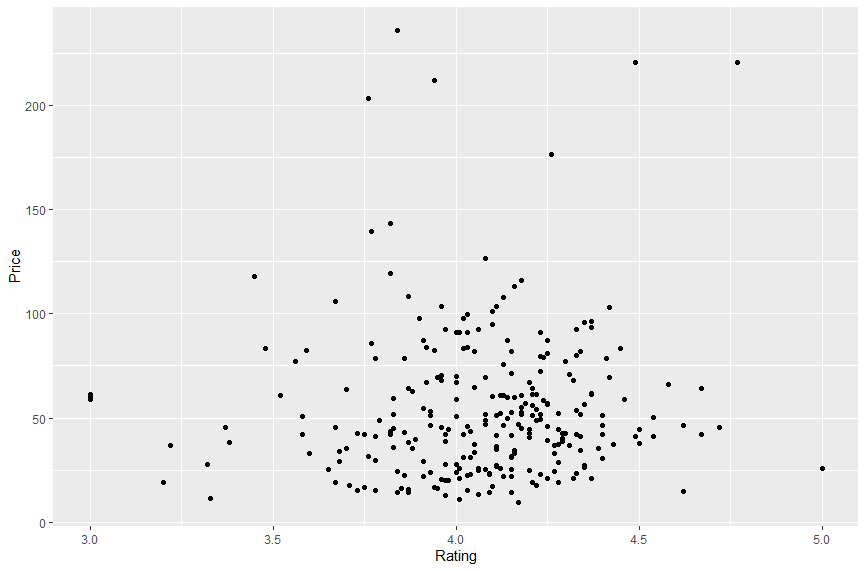
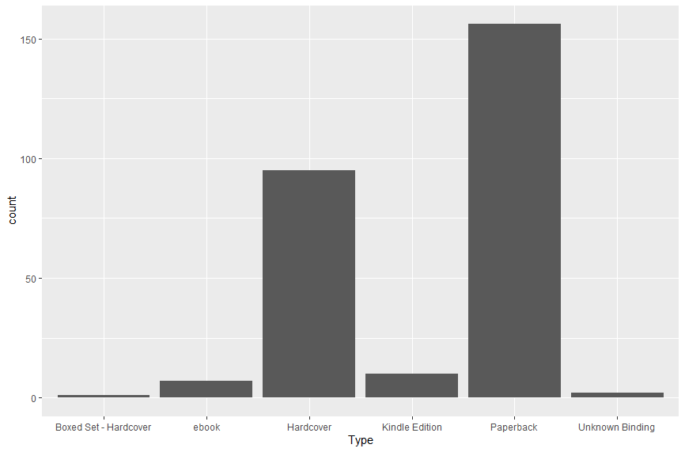

# R-Assignment 4

**Created by Chanatip Ampia(63130500015)**

Choose Dataset:
1. Top 270 Computer Science / Programing Books (Data from Thomas Konstantin, [Kaggle](https://www.kaggle.com/thomaskonstantin/top-270-rated-computer-science-programing-books)) >> [Using CSV](https://raw.githubusercontent.com/safesit23/INT214-Statistics/main/datasets/prog_book.csv)


### Outlines
1. Explore the dataset
2. Learning function from Tidyverse
3. Transform data with dplyr and finding insight the data
4. Visualization with GGplot2

## Part 1: Explore the dataset

```
# Dataset
Prog_book <- read.csv('https://raw.githubusercontent.com/safesit23/INT214-Statistics/main/datasets/prog_book.csv')
```

```
#library
library(dplyr)
library(readr)
#show data type each columns
glimpse(programming_book)
```
In this dataset has
```
Rows: 271
Columns: 7
$ Rating          <dbl> 4.17, 4.01, 3.33, 3.97, 4.06, 3.84, 4.09, 4.15, 3.87, 4.62, 4.03, 3.78, 3.…
$ Reviews         <chr> "3,829", "1,406", "0", "1,658", "1,325", "117", "5,938", "1,817", "2,093",…
$ Book_title      <chr> "The Elements of Style", "The Information: A History, a Theory, a Flood", …
$ Description     <chr> "This style manual offers practical advice on improving writing skills. Th…
$ Number_Of_Pages <int> 105, 527, 50, 393, 305, 288, 256, 368, 259, 128, 352, 352, 200, 328, 240, …
$ Type            <chr> "Hardcover", "Hardcover", "Kindle Edition", "Hardcover", "Kindle Edition",…
$ Price           <dbl> 9.323529, 11.000000, 11.267647, 12.873529, 13.164706, 14.188235, 14.232353…
```
- Rating : คะแนนหนังสือ
- Reviews : จำนวนความคิดเห็น
- Book_title : ชื่อหนังสือ
- Description : คำอธิบาย
- Number_Of_Pages : จำนวนของหนังสือ
- Type : รูปแบบหนังสือ
- Price : ราคาหนังสือ

## Part 2: Learning function from Tidyverse

- Function `map()` from package purrr It transform their input by applying a function to each element and returning a vector the same length as the input

```
#Loading library
library(purrr)
#set list
get_list <- list(
  c(3,5,8),
  c(9,12,2),
  c(4,26,7)
)

get_list %>% map(mean)
```
Result : 
```
[[1]]
[1] 5.333333

[[2]]
[1] 7.666667

[[3]]
[1] 12.33333
```

## Part 3: Transform data with dplyr and finding insight the data

1. The lowest book price
```
lowest_price <- Prog_book %>% select(Price, Book_title, Description) %>% filter(Price == min(Price))
```
Result:
```
$ Price       <dbl> 9.323529
$ Book_title  <chr> "The Elements of Style"
$ Description <chr> "This style manual offers practical advice on improving writing skills. Throughout, the emphasis is~
```

2. Books that rating more than mean
```
More_mean <- Prog_book %>% select(Rating, Price, Book_title) %>% filter(Rating > mean(Rating))
```
Result:
```
$ Rating     <dbl> 4.17, 4.09, 4.15, 4.62, 4.10, 4.22, 4.21, 4.28, 4.37, 4.25, 4.32, 4.13, 4.15, 4.23, 4.09, 4.33, 4.09~
$ Price      <dbl> 9.323529, 14.232353, 14.364706, 14.641176, 17.229412, 17.491176, 18.938235, 19.132353, 21.038235, 21~
$ Book_title <chr> "The Elements of Style", "Start with Why: How Great Leaders Inspire Everyone to Take Action", "Algor~
```

3. Book that type is Hardcover
```
find_type <- Prog_book %>% select(Type, Book_title) %>% filter(Type == "Hardcover")
```
Result:
```
$ Type       <chr> "Hardcover", "Hardcover", "Hardcover", "Hardcover", "Hardcover", "Hardcover", "Hardcover", "Hardcove~
$ Book_title <chr> "The Elements of Style", "The Information: A History, a Theory, a Flood", "Ghost in the Wires: My Ad~
```

4. Book that number of page least than 100
```
find_page <- Prog_book %>% select(Number_Of_Pages, Book_title) %>% filter(Number_Of_Pages < 100)
```
Result:
```
$ Number_Of_Pages <int> 50
$ Book_title      <chr> "Responsive Web Design Overview For Beginners"
```

5. Book that rating more than 4 and price least than 10
```
rating_price <- Prog_book %>% select(Rating, Price, Book_title) %>% filter(Rating > 4 & Price < 10)
```
Result:
```
$ Rating     <dbl> 4.17
$ Price      <dbl> 9.323529
$ Book_title <chr> "The Elements of Style"
```

6. Number of book that type is Hardcover
```
count_book <- Prog_book %>% filter(Type == "Hardcover") %>% count()
```
Result:
```
$ n <int> 95
```

## Part 4: Visualization with GGplot2
### 1.) Graph show relationship between Rating and Price
```
Prog_book %>% ggplot(aes(x = Rating, y = Price)) + geom_point()
```
Result:



### 2.) Graph show number of book for each type
```
Prog_book %>% ggplot(aes(Type)) + geom_bar()
```
Result:


